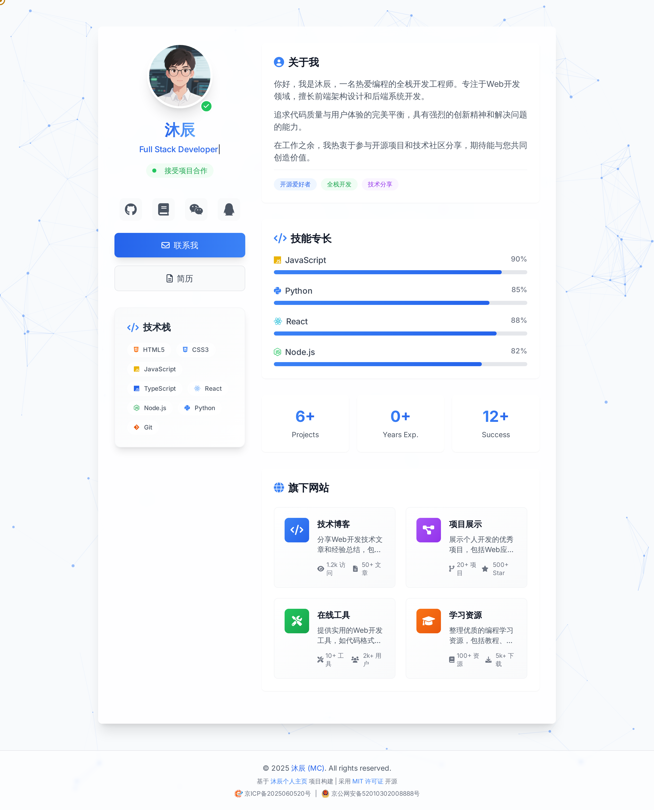

# 🚀 沐辰个人主页

<div align="center">


**一个基于 Tailwind CSS + JavaScript 构建的现代化个人主页**

[🌟 在线预览]([https://mc-homepage.vercel.app/]) | [📖 使用文档](#-快速开始) | [🐛 问题反馈](https://github.com/mcwlgzs/mc-homepage/issues) | [💬 讨论交流](https://github.com/mcwlgzs/mc-homepage/discussions)

</div>

## 📌 项目介绍

这是一个精心开发的现代化个人主页，具有响应式设计、优雅动画和完整的 SEO 优化。项目使用纯静态技术栈，无需后端支持，可轻松部署到任何静态托管服务。

> 💡 **开发亮点**：本项目在代码质量、性能优化和用户体验方面都达到了专业水准，采用现代化的开发理念和最佳实践。

## 🖼️ 效果展示

<div align="center">



*现代化个人主页界面展示*

</div>

### ✨ 主要特点

- 💡 **现代化设计**：采用 Tailwind CSS 构建的清新界面
- 📱 **完全响应式**：完美适配从手机到桌面的各种设备
- 🎨 **精美动画**：包含粒子效果、打字机效果、3D卡片等
- 🔍 **SEO 优化**：完整的元标签、结构化数据和搜索引擎配置
- 🚀 **性能优化**：资源预加载、延迟加载和代码压缩
- ♿ **可访问性**：符合 WCAG 标准的无障碍设计
- 🌐 **跨平台兼容**：支持所有现代浏览器
- 🎉 **简单部署**：零配置，开箱即用
- 🔄 **返回顶部**：平滑滚动的返回顶部按钮
- 📄 **版权保护**：完整的版权声明和知识产权保护
- 🏛️ **合规展示**：包含ICP备案和公安备案信息展示

## 🛠️ 技术栈

### 核心技术
- 🎨 **Tailwind CSS v3.x** - 原子化CSS框架，快速构建现代界面
- 📜 **JavaScript (ES6+)** - 现代JavaScript，实现丰富交互功能
- 🌐 **Particles.js** - 动态粒子背景效果
- ⌨️ **Typed.js** - 流畅的打字机动画效果
- 📦 **Font Awesome 6.0** - 丰富的图标库
- 🎭 **Intersection Observer API** - 高性能滚动动画
- 🎪 **CSS Custom Properties** - 灵活的主题定制系统

### 开发特色
- 🎯 **现代化开发** - 采用最新的Web标准和最佳实践
  - 🧠 优雅的代码结构和组织
  - 🔍 高质量的代码实现
  - 🚀 性能优化和用户体验
  - 📝 完善的文档和注释
  - 🎯 精准的功能实现和错误处理

## 📂 项目结构

```
沐辰个人主页/
├── 📄 index.html              # 主页面
├── 📄 404.html                # 404错误页面
├── 📄 sitemap.xml             # 站点地图
├── 📄 robots.txt              # 爬虫规则
├── 📄 site.webmanifest        # PWA配置
├── 📄 seo-config.json         # SEO配置文件
├── 📄 COPYRIGHT               # 版权声明文件
├── 📄 LICENSE                 # MIT许可证文件
├── 🖼️ homepage.webp           # 项目效果展示图
├── 📁 assets/
│   ├── 📁 css/
│   │   └── 📄 main.css        # 主样式文件
│   ├── 📁 js/
│   │   └── 📄 cursor.js       # 自定义光标效果
│   ├── 📁 images/             # 图片资源
│   │   ├── 🖼️ avatar.png      # 个人头像
│   │   ├── 🖼️ wechat-qr.jpg   # 微信二维码
│   │   ├── 🖼️ favicon.ico     # 网站图标
│   │   ├── 🖼️ icp-icon.svg    # ICP备案图标
│   │   ├── 🖼️ police-icon.svg # 公安备案图标
│   │   ├── 🖼️ android-chrome-192x192.png  # Android图标 192x192
│   │   └── 🖼️ android-chrome-512x512.png  # Android图标 512x512
│   └── 📁 files/              # 文档资源
│       └── 📄 resume.pdf      # 个人简历
└── 📄 README.md               # 项目说明文档
```

## 🚀 快速开始

### 📋 基础要求

- 现代浏览器（支持 ES6+ 和现代 CSS 特性）
- 本地开发服务器（推荐使用 Live Server 或其他静态文件服务器）
- 基本的 HTML/CSS/JavaScript 知识

### 📥 获取项目

#### 方式一：GitHub 克隆
```bash
# 克隆项目
git clone https://github.com/mcwlgzs/mc-homepage.git

# 进入项目目录
cd 沐辰个人主页

# 使用 VS Code 打开（可选）
code .
```

#### 方式二：Gitee 克隆（国内用户推荐）
```bash
# 克隆项目
git clone https://gitee.com/mcwlgzs/mc-homepage.git

# 进入项目目录
cd 沐辰个人主页
```

#### 方式三：直接下载
1. 点击 GitHub/Gitee 页面的 "Download ZIP" 按钮
2. 解压到你的工作目录
3. 使用编辑器（推荐 VS Code）打开项目

### 3️⃣ 开发服务器设置

#### 使用 VS Code Live Server（推荐）
1. 安装 Live Server 扩展
2. 右键 `index.html` 选择 "Open with Live Server"

#### 使用 Python 简易服务器
```bash
# Python 3.x
python -m http.server 8080

# 访问 http://localhost:8080
```

#### 使用 Node.js http-server
```bash
# 安装 http-server
npm install -g http-server

# 启动服务器
http-server

# 访问 http://localhost:8080
```

## 💡 自定义配置

### 1️⃣ 基础信息修改
编辑 `index.html` 中的以下部分：
```html
<!-- SEO Meta Tags -->
<title>Your Name - 全栈开发工程师</title>
<meta name="description" content="你的个人简介">
<meta name="author" content="你的名字">

<!-- 个人信息 -->
<h1 class="gradient-text">你的名字</h1>
<div id="typed-text"></div> <!-- 修改 typed.js 配置中的文字 -->
```

### 2️⃣ 样式定制
在 `assets/css/main.css` 中修改：
```css
:root {
    --primary-color: #3b82f6;   /* 主色调 */
    --secondary-color: #8b5cf6; /* 次要色调 */
    /* 其他颜色变量 */
}
```

### 3️⃣ 资源替换
1. 替换头像：
   - 准备一张正方形头像图片
   - 重命名为 `avatar.png` 并放置在 `assets/images/` 目录

2. 更换图标：
   - 准备 favicon.ico 文件（建议包含 16x16 和 32x32 尺寸）
   - 准备 192x192 和 512x512 尺寸的 PNG 图标（用于移动设备）
   - 放置在 `assets/images/` 目录

3. 更新简历：
   - 将你的简历 PDF 文件重命名为 `resume.pdf`
   - 放置在 `assets/files/` 目录

### 4️⃣ 社交媒体配置
修改 `index.html` 中的社交媒体链接：
```html
<a href="https://github.com/你的用户名" class="social-icon-card">
<a href="https://linkedin.com/in/你的用户名" class="social-icon-card">
<!-- 其他社交媒体链接 -->
```

### 5️⃣ 备案信息配置
如需修改备案信息，请编辑 `index.html` 和 `404.html` 中的备案号：
```html
<!-- ICP备案信息 -->
<div class="icp-info">
    <a href="http://beian.miit.gov.cn">
        
        你的ICP备案号
    </a>
    |
    <a href="http://www.beian.gov.cn/portal/registerSystemInfo?recordcode=你的备案号">
        
        你的公安备案号
    </a>
</div>
```

## 🔍 SEO 配置

### 6️⃣ 站点地图设置
修改 `sitemap.xml` 中的网站 URL：
```xml
<loc>https://你的域名.com/</loc>
```

### 7️⃣ 爬虫配置
更新 `robots.txt` 中的站点地图地址：
```txt
Sitemap: https://你的域名.com/sitemap.xml
```

### 8️⃣ 结构化数据
修改 `index.html` 中的 JSON-LD 数据：
```javascript
{
    "@type": "Person",
    "name": "你的名字",
    "jobTitle": "你的职位",
    // 其他信息
}
```

## 📱 响应式设计
项目包含以下断点：
- 📱 手机：< 640px
- 📱 平板：640px - 768px
- 💻 笔记本：768px - 1024px
- 🖥️ 桌面：> 1024px

## 🚀 部署指南

### 🌐 GitHub Pages 部署（推荐）
```bash
# 1. Fork 本项目到你的 GitHub 账号
# 2. 克隆到本地并修改内容
git clone https://github.com/mcwlgzs/mc-homepage.git
cd 沐辰个人主页

# 3. 修改配置后提交
git add .
git commit -m "customize personal information"
git push origin main

# 4. 在 GitHub 仓库设置中启用 Pages
# Settings > Pages > Source: Deploy from a branch > main
```

### 🇨🇳 Gitee Pages 部署（国内推荐）
```bash
# 1. 导入 GitHub 项目到 Gitee
# 2. 在 Gitee 仓库中启用 Pages 服务
# 服务 > Gitee Pages > 部署分支: main
```

### ☁️ Netlify 部署
1. 注册 [Netlify](https://netlify.com) 账号
2. 点击 "New site from Git"
3. 连接 GitHub/GitLab 并选择项目
4. 构建设置：
   - Build command: 留空
   - Publish directory: `./`
5. 点击 "Deploy site"

### ⚡ Vercel 部署
1. 注册 [Vercel](https://vercel.com) 账号
2. 点击 "New Project"
3. 导入 GitHub 项目
4. 自动部署完成

### 🔧 自定义域名
部署完成后，可以在各平台设置自定义域名：
- **GitHub Pages**: Settings > Pages > Custom domain
- **Gitee Pages**: 服务 > Gitee Pages > 自定义域名
- **Netlify**: Site settings > Domain management
- **Vercel**: Project settings > Domains

## 🔄 更新日志

### v1.1.0 (2025-06-05)
- 📄 **版权信息完善**
  - 🔄 更新所有文件的版权年份为2025年
  - 📍 修复页面底部版权信息位置，确保正确显示在页面底部
  - 📋 新增COPYRIGHT版权声明文件，包含详细的版权信息和使用条款
  - 📝 为所有源代码文件添加版权注释头部
  - 📖 更新README文档的版权章节，添加详细说明
- 🏛️ **ICP备案信息**
  - 🆔 添加ICP备案号展示
  - 🚔 添加公安备案号展示
  - 🎨 创建专用备案图标文件（ICP图标和公安图标）
  - 📱 支持响应式设计，移动端垂直排列
  - 🔗 备案号可点击跳转到相应查询页面
- 🎨 **页面布局优化**
  - 🔧 修复footer布局问题，使用flexbox确保底部显示
  - 📐 优化页面整体布局结构
  - 📱 改进移动端显示效果
  - 🎯 增强响应式设计支持
- 🧹 **代码清理**
  - 🗑️ 移除临时的版权检查脚本
  - 📄 删除临时总结报告文件
  - 🔧 优化CSS样式结构

### v1.0.0 (2025-06-04)
- ✨ **初始版本发布**
  - 🎨 现代化响应式设计，基于 Tailwind CSS
  - 🌟 精美粒子背景效果和打字机动画
  - 📱 完美适配移动端和桌面端
  - 🔄 返回顶部按钮，支持平滑滚动
  - 🎨 社交媒体链接集成（GitHub、掘金、微信、QQ）
  - 📱 微信二维码弹窗功能
  - 🚫 专业的404错误页面
- 🔍 **SEO优化**
  - 📊 完整的sitemap.xml配置
  - 🤖 robots.txt爬虫规则
  - 📈 结构化数据支持
  - 🏷️ 完善的meta标签配置
  - 🌐 PWA支持和网站清单
- 🚀 **性能优化**
  - ⚡ 资源预加载和延迟加载
  - 🗜️ Apache服务器配置(.htaccess)
  - 💾 浏览器缓存策略
  - 🔒 安全头配置
  - 🎯 代码压缩和优化
- 🎯 **用户体验**
  - ♿ 无障碍访问支持
  - 🎭 流畅的动画效果
  - 🖱️ 自定义光标动画
  - 🎨 优雅的界面设计
- 🛠️ **技术特性**
  - 📦 纯静态技术栈，无需后端
  - 🚀 零配置，开箱即用
  - 🌐 跨平台兼容性
  - 📱 PWA渐进式Web应用支持

## 🤝 贡献指南

欢迎提交 Issue 和 Pull Request！

### 贡献流程
1. Fork 本项目
2. 创建特性分支 (`git checkout -b feature/AmazingFeature`)
3. 提交更改 (`git commit -m 'Add some AmazingFeature'`)
4. 推送到分支 (`git push origin feature/AmazingFeature`)
5. 开启 Pull Request

### 开发规范
- 代码风格：遵循现有代码风格
- 提交信息：使用语义化提交信息
- 文档：更新相关文档

## 📮 联系与支持

- 📧 邮箱：mcwlgzs@qq.com
- 💻 GitHub：[@mcwlgzs](https://github.com/mcwlgzs)
- 🇨🇳 Gitee：[@mcwlgzs](https://gitee.com/mcwlgzs)
- 🌐 个人网站：[mcwl.net](https://mcwl.net)
- 💬 讨论：[GitHub Discussions](https://github.com/mcwlgzs/mc-homepage/discussions)

## ⭐ Star History

[](https://star-history.com/#mcwlgzs/mc-homepage&Date)

## 📄 版权与许可证

### 版权信息
- **项目名称**：沐辰个人主页 (Muchen Personal Homepage)
- **版权所有**：© 2025 沐辰 (MC)
- **作者**：沐辰 (MC)
- **联系邮箱**：mcwlgzs@qq.com
- **项目地址**：https://github.com/mcwlgzs/mc-homepage
- **官方网站**：https://mcwl.net
- **备案状态**：已完成ICP备案和公安备案

### 许可证
本项目采用 [MIT 许可证](LICENSE) 开源，这意味着：

✅ **允许的使用方式**：
- 商业使用
- 修改代码
- 分发代码
- 私人使用
- 专利使用

⚠️ **使用条件**：
- 必须包含版权声明和许可证声明
- 必须包含原始许可证文件

❌ **免责声明**：
- 作者不承担任何责任
- 不提供任何担保

### 引用说明
如果您在项目中使用了本代码，请在适当位置添加以下版权声明：
```
基于沐辰个人主页项目 (https://github.com/mcwlgzs/mc-homepage)
Copyright (c) 2025 沐辰 (MC)
Licensed under MIT License
```

## 🙏 致谢

- 💻 **现代化开发** - 感谢现代Web技术和开发工具的支持，让项目开发更加高效
- 🎨 **Tailwind CSS** - 感谢提供优秀的原子化CSS框架
- 🌟 **开源社区** - 感谢所有开源项目的贡献者
- 👥 **所有贡献者** - 感谢所有为这个项目做出贡献的开发者！

---

<div align="center">

**⭐️ 如果这个项目对你有帮助，欢迎 star 支持！**

**🔗 别忘了在你的个人主页中添加本项目的链接哦！**

</div>
